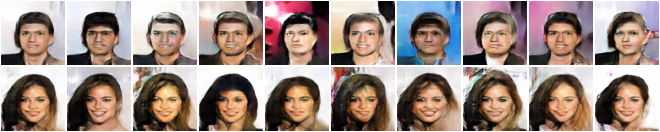
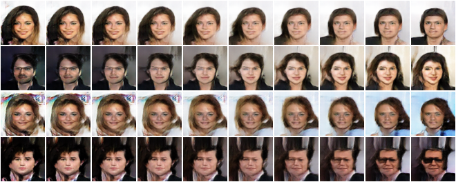
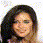
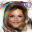
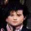
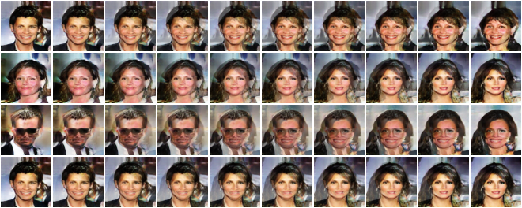
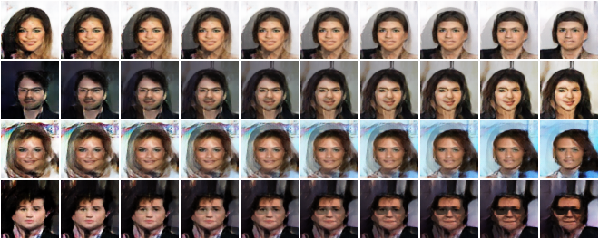
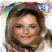

# CelebA GANs in PyTorch
### IFT6135 Representation Learning &mdash; Assignment 4

## Dependencies
Tested on Python 3.6.x.
* [PyTorch](http://pytorch.org/) (0.3.1)
* [NumPy](http://www.numpy.org/) (1.14.2)
* [FFmpeg](https://www.ffmpeg.org) (3.4.2)
* [Imagemagick](https://www.imagemagick.org/script/index.php) (7.0.7)


## CelebA dataset
The full [CelebA](http://mmlab.ie.cuhk.edu.hk/projects/CelebA.html) is available [here](https://drive.google.com/open?id=1p6WtrxprsjsiedQJkKVoiqvdrP1m9BuF). To resize the RGB images to 64 by 64 pixels, run `CelebA_helper.py`.

## Training
To train a model, simply specify the model type (`gan`, `wgan` or `lsgan`) with the appropriate hyperparameters. In case these parameters are not specified, the program reverts back to default training parameters from the original papers.

```
./train.py --type wgan \
           --nb-epochs 50 \
           --batch-size 64 \
           --learning-rate 0.00005 \
           --optimizer rmsprop \
           --critic 5 \
           --ckpt ./../checkpoints/trained_wgan \
           --cuda
```

This assumes that the training images are in `./../data/celebA_all`. To train using a smaller dataset (*e.g.* 12800 images), create a new folder called `./../data/celebA_redux` and train using the `--redux` flag.

To create GIF/MP4 videos like below, run `src/checkpoints/make_anim.sh trained_*` after training. This will annotate each epoch using Imagemagick and combine them into a single video using FFmpeg.

GAN | WGAN | LSGAN 
:--------------------------------------------:|:------------------------------------------------:|:------------------------------------------------:
 |  | 

Notice how the LSGAN suffers from total mode collapse at epoch 45.

## Latent space exploration

To explore the face manifold in latent space, run
```
./lerp.py --pretrained ./checkpoints/gan/dcgan-gen.pt \
          --dir ./out \
          --latent-play 140 \
          --cuda
```

This will use RNG seed 140 to first generate a random tensor of size 100. Then, each dimension will be clamped to &pm; 3 and saved to a new image`./out/dim*.png`. The result is 100 different images that only differ by one dimension from the original image. These images can then be analyzed to figure out which dimension control different generative features (*e.g.* open/close mouth, hair color, gender, nose shape, etc.).

GAN | WGAN
:--------------------------------------------:|:------------------------------------------------:|
 | 


## Latent space interpolation
To perform linear interpolation in *latent space*, run

```
./lerp.py --pretrained ./checkpoints/gan/dcgan-gen.pt \
          --dir ./out \
          --latent 140 180 \
          --nb-frames 50 \
          --video \
          --cuda
``` 
This will linearly interpolate between two random *tensors* generated from seeds 140 and 180 and create a GIF/MP4 videos of the sequence. The frames and videos will be stored in `./out`.


<table align="center">
  <tr align="center">
    <td colspan=4>GAN</td>
    <td colspan=4>WGAN</td>
  </tr>
  <tr align="center">
    <td colspan=4></td>
    <td colspan=4></td>
  </tr>  
  <tr align="center">
    <td></td>
    <td></td>    
    <td></td>
    <td></td>
    <td></td>
    <td></td>    
    <td></td>
    <td></td>
  </tr>
</table>

  
## Screen space interpolation
To perform linear interpolation in *screen space*, run

```
./lerp.py --pretrained ./checkpoints/gan/dcgan-gen.pt \
          --dir ./out \
          --screen 140 180 \
          --nb-frames 50 \
          --video \
          --cuda
``` 
This will linearly interpolate between two random *images* generated from seeds 140 and 180 and create a GIF/MP4 videos of the sequence.

<table align="center">
  <tr align="center">
    <td colspan=4>GAN</td>
    <td colspan=4>WGAN</td>
  </tr>
  <tr align="center">
    <td colspan=4></td>
    <td colspan=4></td>
  </tr>  
  <tr align="center">
    <td></td>
    <td></td>    
    <td></td>
    <td></td>
    <td></td>
    <td></td>    
    <td></td>
    <td></td>
  </tr>
</table>
